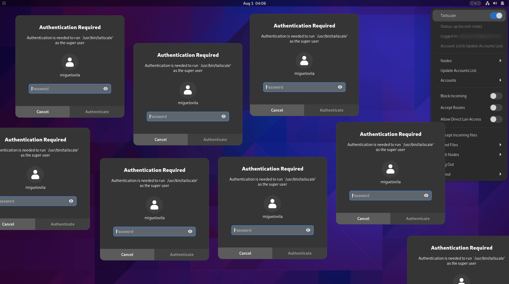

If you are ike me and use Tailscale daily, you've probably felt the irritation of being prompted for a password every time you tweak a setting. Whether it's switching exit nodes, changing accounts, or adjusting other settings, those password prompts can be realy annoying. Let's change this behavior!



## Why Does Tailscale Ask for Root Privileges?

Tailscale isn't trying to upset you. It changes the network configuration of the system: the routing table, the DNS servers, etc. These tasks require root privileges.

## The Password-Free Solution

Fortunately, `sudo` allows us to configure which commands can be executed without a password by using the `NOPASSWD` directive. We can use this feature to allow the `sudo tailscale` command to be executed without a password.

And if you're using the "Tailscale Status" GNOME extension, you'll need to adapt its source code in order to avoid the password prompt. (Nothing too complicated, don't worry).

## Step-by-Step Guide

Read all the steps before doing anything, so you know what you're doing. Do it at your own risk, I'm not responsible for any damage you may cause to your system.

### 1. Edit the sudoers file

- Launch a terminal and type `sudo visudo`. If you're more comfortable with another text editor, like `nano`, use the `EDITOR` environment variable: `EDITOR=nano sudo visudo`.
- At the end of the file, insert the lines below, replacing `<username>` with your actual username:

```bash
<username> ALL=NOPASSWD: /bin/tailscale
<username> ALL=NOPASSWD: /usr/bin/tailscale
```

These lines let the user `<username>` run the `sudo tailscale` command without a password. If you want to allow all users to run the command without a password, replace `<username>` with `ALL` (this is not recommended).

> **WARNING**: Always use `visudo` to edit the sudoers file. If you edit it with a different text editor and make a mistake, you might get locked out of your system.

### 2. Adapt Tailscale Status source code

Because we can now run `sudo tailscale` without a password, we need to adapt Tailscale Status to use `sudo` when executing `tailscale`.

- Find the extension's source code. It's either in `~/.local/share/gnome-shell/extensions/tailscale-status@maxgallup.github.com` or `/usr/share/gnome-shell/extensions/tailscale-status@maxgallup.github.com`, depending on your installation type.
- Inside the extension folder, open `extension.js` and using the find and replace tool, replace all occurrences of `pkexec` with `sudo`.
- Save and reboot GNOME Shell. For Xorg, hit `Alt+F2` and type `r`. For Wayland, log out and log back in.

> **NOTE**: You might need to re-do this step after updating the extension.

## Wrap-Up

There you have it! A smoother, password-prompt-free Tailscale experience.
