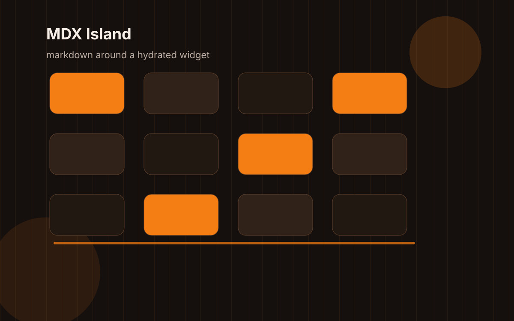

The homepage has one job before all the other jobs: make the site feel like it belongs to a specific person.

## The risk

Portfolio templates like to sand the surface until every person becomes "a developer passionate about building delightful experiences." That may be true, but it is also a sentence with no fingerprints.

## The useful hierarchy

The first screen should answer:

- Who is this?
- What kind of work shows up here?
- Where should I click next?

## The weird bits

The pixel portrait matters. The orange matters. The blinking underscore matters. They are small signals that the site has a memory.

## The layout test

This post exists partly to test a very long title in archives, tag pages, search results, and article metadata.
