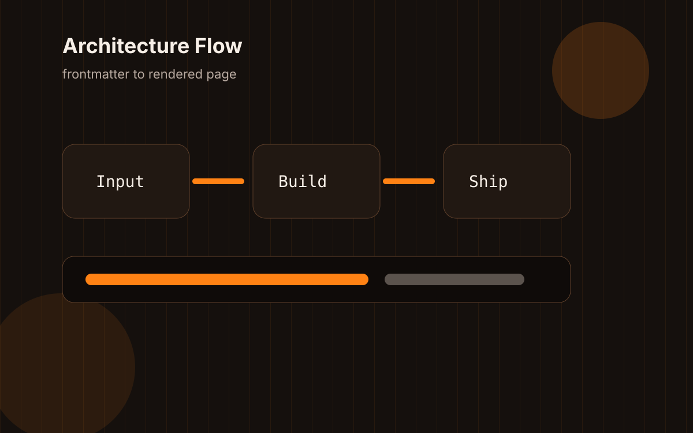

import LatencyBudget from "@/components/demos/LatencyBudget";

This is fake seed content, but the shape of the problem is real enough: a personal website can be technically correct and still feel unfinished.



## The awkward list

The first pass found six edges worth testing:

1. Mobile navigation has to be visible before it can be elegant.
2. Search feels broken if it opens a whole page when the user expects a quick command.
3. Dark mode can be right at the document level and wrong in one control.
4. A homepage can have personality and still need a clearer reading path.
5. Empty archives need to look intentional.
6. Fake content should be weird enough to stress the layout.

## A tiny interactive budget

The demo below is intentionally small. Its job is to verify that MDX can host a hydrated React component, that shadcn controls inherit the theme, and that the article layout does not collapse around interactive content.

<LatencyBudget client:load />

## The route check

```astro
---
const posts = page.posts.slice(0, 5);
---

<PostList entries={posts} />
```

The important part is not the snippet. The important part is that the same published-content filter feeds routes, related content, RSS, and search.

## What felt better

The page started feeling more like mine again when the tiny pieces returned: the blinking underscore, the sharp orange, the portrait, and text that sounds like a person who has actually opened the editor.

## What still needs taste

Seed content can prove mechanics, but taste needs real writing. The fixtures only tell me where the templates bend.
