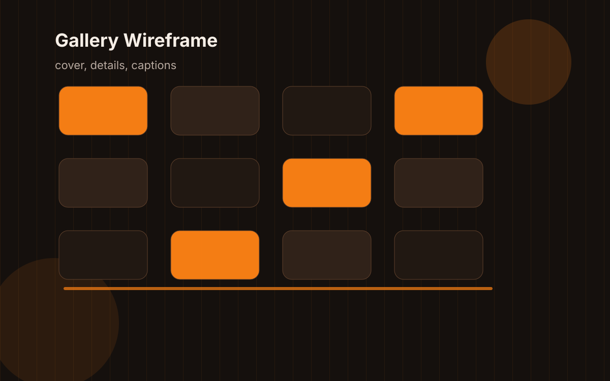

A project page earns trust by answering simple questions quickly. What did you build? Why did it need to exist? What got hard? What changed because of the work?

## The minimum shape

I like project pages that make room for both the result and the mess.

- The problem should be visible before the architecture.
- The screenshots should explain something.
- The repository link should not be the only proof.
- The lessons should include at least one thing that did not work.

## Screenshot discipline

A screenshot without a caption is usually decoration. A screenshot with a caption can become evidence.

## The fake rubric

| Section  | Good sign            | Warning sign                          |
| -------- | -------------------- | ------------------------------------- |
| Overview | I know what it does. | The page starts with tool names.      |
| Approach | Tradeoffs are named. | Every decision was obviously correct. |
| Results  | Claims have context. | Numbers float without baseline.       |

## Why this matters here

This website needs project pages that feel like case notes, not trophy shelves. That is the difference I want the templates to encourage.
