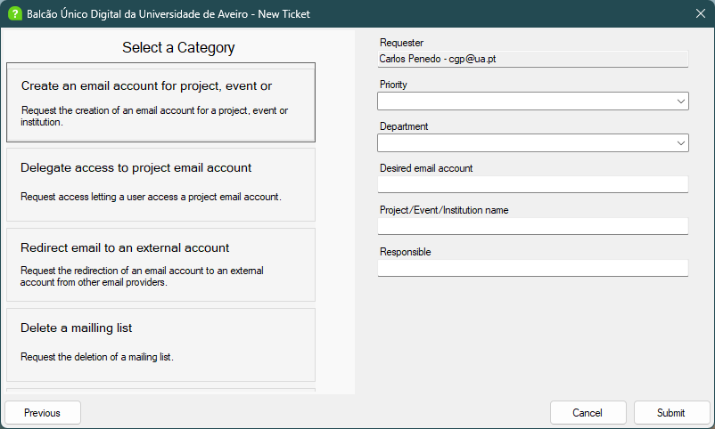
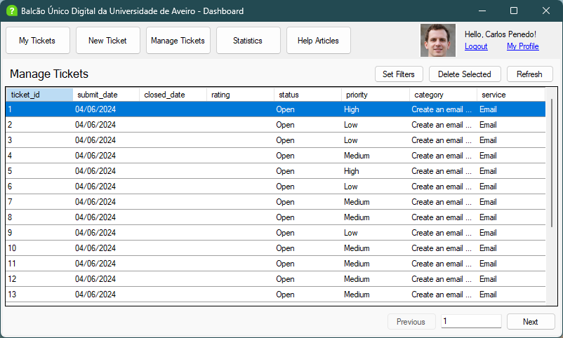

Um pedido de conta de email e um pedido de ligação à rede passam pelo mesmo balcão de apoio, mas precisam de informações diferentes. Um pede um endereço e o nome de um projeto; o outro precisa de uma localização. O desafio do BUD era esse: suportar vários tipos de pedido informático da universidade sem criar um ecrã separado para cada um.

Desenvolvi o BUD com o Miguel Reis em 2024, para a cadeira de Bases de Dados da Universidade de Aveiro. Dividimos o trabalho de forma igual, tendo-me concentrado nas relações mais complexas da base de dados e na interface em Windows Forms. Partimos do Balcão Único Digital da universidade para desenvolver a nossa própria aplicação de apoio. A aplicação desktop usa C#, com o SQL Server a guardar o catálogo de serviços, os pedidos, as mensagens, os anexos e as associações dos utilizadores a departamentos e perfis.

## O formulário vem da base de dados

Criar um pedido começa pela escolha de um serviço e de uma categoria. Ao escolher Email e depois a criação de uma conta para um projeto, surgem campos para o departamento, o endereço pretendido, o nome do projeto e a pessoa responsável.



_A categoria escolhida determina os dados que o requerente precisa de fornecer._

Quatro tabelas descrevem o formulário: `service`, `category`, `field` e `category_field`. Uma vista SQL junta-as, e o cliente constrói cartões e campos de preenchimento a partir do resultado. Cada categoria tem também um perfil mínimo, que o cliente verifica ao carregar as opções disponíveis.

É possível acrescentar um campo de texto normal através de registos e associações na base de dados. Não é preciso criar outro formulário Windows Forms. Os seletores de departamento e sala continuam a ser casos especiais no código C#; os metadados ainda não descrevem todos os tipos de campo nem as regras de validação.

As respostas submetidas têm uma tabela própria, `ticket_field`. Assim, a definição de uma categoria fica separada dos valores fornecidos num pedido concreto. Alterar as associações entre uma categoria e os seus campos não apaga respostas já ligadas a pedidos, embora as definições dos campos referenciados tenham de continuar disponíveis.

## Uma submissão, uma transação

O número de campos varia consoante a categoria, pelo que uma lista fixa de parâmetros no procedimento seria pouco prática. O cliente reúne as respostas numa `DataTable` e envia-as para o SQL Server como um parâmetro do tipo tabela.

Dentro de `CreateTicket`, o procedimento insere o pedido, obtém o ID gerado e guarda as respostas fornecidas:

```sql
SET @ticket_id = (SELECT SCOPE_IDENTITY())

INSERT INTO BUD.ticket_field (ticket_id, field_id, [value])
SELECT @ticket_id, field_id, [value]
FROM @fields;
```

Este excerto está dentro de uma transação com tratamento de erros. Se a gravação de uma resposta falhar, a inserção do pedido também é anulada. O cliente pode submeter um conjunto diferente de campos sem alterar a assinatura do procedimento.

A mesma ideia aplica-se aos anexos. `SendAttachmentMessage` guarda uma mensagem e o ficheiro associado numa transação. Os bytes do ficheiro ficam no SQL Server como `VARBINARY(MAX)`, e a conversa apresenta uma ligação para guardar e abrir o anexo.

## Acompanhar um pedido até à resolução

Os requerentes veem os seus próprios pedidos. A equipa de apoio tem uma fila partilhada com filtros por serviço, categoria, prioridade e estado, além de controlos para atualizar, reabrir e eliminar pedidos.



_A vista da equipa de apoio carrega páginas de 20 pedidos, aplicando os filtros selecionados em SQL._

As duas vistas usam o procedimento `SeeUserTickets`. Passar o ID de um requerente limita os resultados a essa pessoa; a vista da equipa de apoio omite-o e fornece os parâmetros de paginação. A base de dados aplica os filtros antes de devolver uma página.

Fechar um pedido regista a data de fecho e permite ao requerente avaliar a resolução de zero a cinco. Reabri-lo apaga tanto a data como a avaliação anterior através de um trigger. Caso contrário, um pedido ativo poderia continuar com a data e a avaliação de uma resolução anterior. Eliminar um pedido remove também a conversa, os anexos e os campos submetidos.

A aplicação inclui artigos de ajuda pesquisáveis e páginas de perfil que mostram os departamentos e perfis associados ao utilizador, com as respetivas datas. Estas associações são registos separados, permitindo que uma pessoa tenha mais de um perfil ou pertença a mais de um departamento.

## Experimentar com 20 000 pedidos

O script de dados de exemplo gera 20 000 pedidos. Usámo-los para experimentar a fila da equipa de apoio e comparar consultas antes e depois de acrescentar índices sobre o requerente, a prioridade e o estado.

A experiência guardada regista uma descida de 110 ms para 34 ms na consulta por requerente e de 47 ms para 13 ms na consulta por prioridade. São medições individuais feitas durante o desenvolvimento: o script executa cada consulta uma vez e não controla os efeitos da cache. Ilustram os padrões de acesso que estudámos, mas não demonstram uma melhoria global do desempenho da aplicação.

Para usar a aplicação fora do contexto da cadeira, colocaria uma camada de serviços entre o cliente desktop e o SQL Server. O cliente atual liga-se diretamente com credenciais partilhadas da base de dados, e as verificações de perfil controlam sobretudo a interface. A validação das permissões de cada operação deveria ficar nessa camada de serviços. Enriquecer os metadados dos formulários seria o passo seguinte para alargar o sistema de categorias.

O [repositório](https://github.com/miguelovila/ua-bd-bud) inclui a aplicação, os scripts SQL, os diagramas relacionais, o relatório original e uma demonstração em vídeo.
