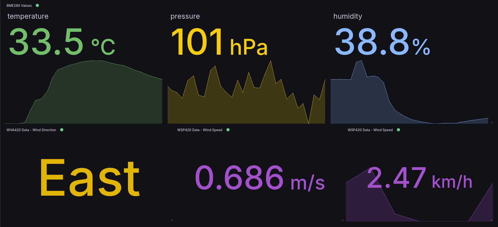

Os sensores de vento desta estação são peças que desenhei e construí. As conchas, o rotor e o cata-vento usam componentes impressos; ímanes e sensores de efeito Hall transformam o movimento em sinais que um ESP32 consegue ler. Em conjunto com um BME280, permitem à estação medir temperatura, humidade, pressão e direção do vento, além de estimar a sua velocidade.

Construí a estação com o Francisco Ribeiro em 2025, para a cadeira de Arquiteturas de Sistemas Embebidos da Universidade de Aveiro. Planeei e montei o hardware, desenvolvi os sensores de vento e os respetivos drivers em C, e escrevi o driver do BME280. O Francisco ficou responsável pelo Grafana, MQTT, Wi-Fi e pela integração do cartão SD. A fotografia acima mostra o protótipo completo durante uma demonstração no exterior.

## Transformar movimento numa leitura

O anemómetro, WSP420, tem três conchas à volta de um eixo rotativo, com ímanes a passar por um sensor Hall enquanto o rotor gira. O ESP32 conta os flancos ascendentes numa entrada GPIO através de uma rotina de interrupção. Uma tarefa FreeRTOS abre uma janela de contagem de sete segundos e depois converte a frequência dos impulsos numa estimativa da velocidade.

O cálculo depende do raio configurado para o rotor e de um fator de calibração. Esta última parte é importante: o código consegue contar impulsos, mas a relação entre esses impulsos e a velocidade do vento também depende da mecânica. O atrito, a geometria das conchas e a posição dos ímanes afetam o resultado. O protótipo usa um fator de calibração de exemplo; é necessário compará-lo com um anemómetro de referência antes de tratar os valores como medições rigorosas do vento.

O cata-vento WVA420 usa o mesmo princípio de deteção de outra forma. Quatro entradas Hall correspondem a norte, este, sul e oeste. Uma única entrada ativa identifica uma direção cardinal; duas entradas adjacentes identificam a direção entre elas. Norte e este em conjunto dão nordeste. Assim, quatro entradas digitais permitem distinguir oito direções, devolvendo `Unknown` quando nenhuma está ativa. A montagem tem de ficar fisicamente alinhada com o norte.

## Escrever os drivers

O BME280 fornece as três medições ambientais. Escrevi o driver em C, incluindo o acesso a registos por I²C e SPI, a identificação do chip, a reinicialização, a configuração e a compensação com os coeficientes de calibração de fábrica do sensor. A estação montada usa I²C a 100 kHz.

Um valor bruto de um registo é apenas o início de uma medição. O driver extrai temperatura, pressão e humidade dos registos de medição do dispositivo e aplica as equações de compensação. Também permite escolher a sobreamostragem, a filtragem e o modo de funcionamento. A aplicação usa o modo normal com sobreamostragem de 1× nos três canais.

O trabalho dos sensores está dividido por três tarefas FreeRTOS:

| Tarefa                          | Intervalo aproximado entre publicações                                          |
| ------------------------------- | ------------------------------------------------------------------------------- |
| Temperatura, humidade e pressão | A cada 2 segundos                                                               |
| Direção do vento                | A cada 2 segundos                                                               |
| Velocidade do vento             | A cada 10 segundos: 7 segundos de contagem, seguidos de uma pausa de 3 segundos |

A tarefa de velocidade do vento cede o processador durante a janela de contagem, permitindo que as outras tarefas continuem a executar. A pausa também significa que esta versão não conta os impulsos do vento de forma contínua.

## Guardar as leituras na estação

_O controlador e o armazenamento ficam abaixo dos sensores. O módulo UPS com bateria está montado por cima deles._

O cartão SD guarda tanto as definições de ligação como as medições. As definições de Wi-Fi e MQTT são lidas no arranque, pelo que mudar de rede não exige recompilar o firmware. Depois de se ligar, o ESP32 tenta sincronizar o relógio por SNTP.

Cada leitura bem-sucedida passa por um módulo comum de tratamento de dados. Este acrescenta uma marca temporal, tenta adicionar uma linha ao CSV e publica uma mensagem JSON por MQTT. Tópicos separados transportam as leituras ambientais, a direção e a velocidade.

O projeto fica assim com um registo local e uma transmissão em direto. Se o MQTT perder a ligação depois do arranque, as leituras continuam a passar pelo registo em SD. O firmware não reenvia esses ficheiros quando a ligação regressa; para recuperar as medições em falta, é preciso obtê-las do cartão. A publicação MQTT usa QoS 0.

## Ver as medições

_O painel da demonstração original. A legenda da pressão mantém-se como estava no protótipo: o firmware fornece o valor em kPa, embora o painel indique hPa._

O Grafana permitiu observar a resposta da estação durante a demonstração. O painel reúne os dados dos vários sensores, enquanto o firmware mantém os drivers separados da formatação dos dados, do armazenamento e da rede.

As fotografias também mostram bem o que falta no protótipo. A cablagem precisa de uma caixa adequada para utilizações mais longas no exterior, e os sensores de vento precisam de melhorias mecânicas e de calibração. O módulo de bateria está presente, mas o firmware ainda não monitoriza a carga nem ajusta a amostragem para poupar energia.

Antes de uma utilização mais prolongada, corrigiria também as unidades de pressão, o uso de memória no módulo de tratamento de dados e a recuperação no arranque quando o broker MQTT está indisponível.

O [repositório do código](https://github.com/miguelovila/smart-weather-station) inclui o firmware, a referência de ligações elétricas, a apresentação original e as instruções de configuração.
